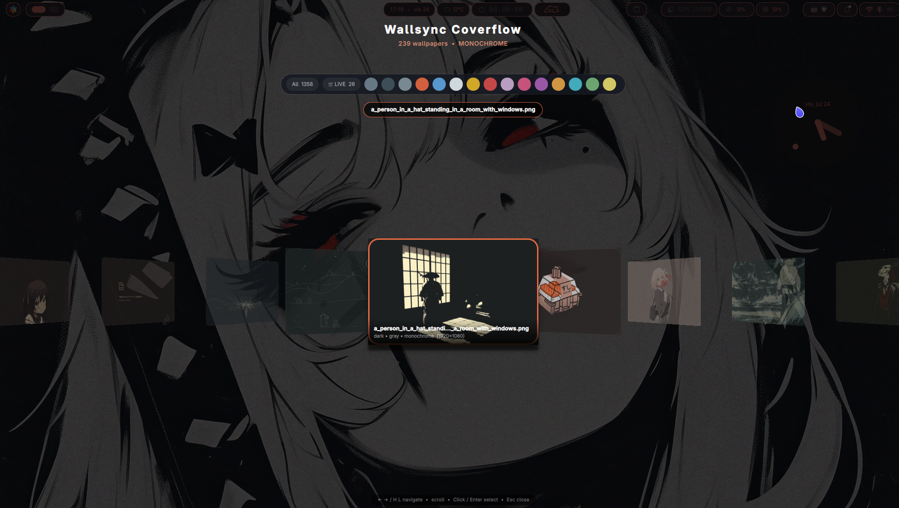

<p align="center">
  
</p>

<h1 align="center">🎨 wallsync-dms</h1>

<p align="center">
  <b>Dynamic dual-monitor wallpaper synchronizer ported as a native DankMaterialShell (DMS) background daemon.</b>
</p>

---

## ✨ Features

- **🎨 Dynamic Material You colors** — Fully integrated with Matugen and DMS. Colors are automatically extracted and pushed to all active outputs to trigger system themes dynamically.
- **🎠 Efficient 3D Coverflow** — Optimizations limit render resources and shadow computations only to the active focal card, ensuring a clean 0% GPU/CPU footprint on standby.
- **⚡ Wayland Standalone Overlay** — The Coverflow picker overlay runs in an isolated Quickshell process under demand and is completely killed on select or ESC to free resources.
- **👁️ Perceptual HSL matching** — Coordinates secondary monitors matching according to human HSL vision perception weights, using a strict vectorial average for dominant Hue.
- **🎨 Monochrome Vibe filter** — Grayscale and neutral wallpapers are indexed under an exclusive `monochrome` vibe, cleaning color filter lists.
- **📦 No Python pip requirements** — Developed purely using python standard libraries.

---

## ⚙️ Settings

Configurable directly from your DMS Settings Panel -> Complementos -> Wallsync DMS:
- **Wallpaper Directories**: Set directories as comma-separated values (e.g. `~/Pictures/Wallpapers`).
- **Transition Settings**: Configure awww transition type (grow, fade, wave, wipe, outer, etc.) and speed step.
- **HSL Matching Weights**: Fine-tune the Hue, Saturation and Lightness weights.
- **Index Workers**: Optimize the threading pool according to your CPU core count.
- **Vibe Tag Style**: Choose between `Text with Color Dot` or a minimal `Color Dot Only` chip rendering.

---

## 📥 Installation

```bash
git clone https://github.com/Zhainy/wallsync-dms.git
cd wallsync-dms
chmod +x install.sh
./install.sh
```

### Enable the plugin
1. Open DMS Settings (Super + Space -> Settings -> Plugins/Complementos).
2. Click **Scan for Plugins**.
3. Toggle the switch for **Wallsync DMS** to enable the daemon.
4. Set up your custom wallpaper directories inside the settings section.
5. Generate the database using the command below:
   ```bash
   wallsync-dms index --force
   ```

---

## ⌨️ Binds (Niri config)

Add the following inside your `~/.config/niri/config.kdl` (or `~/.config/niri/dms/binds.kdl` inside the `binds` node) to map keybindings:

```kdl
binds {
    // Launch picker Coverflow Overlay
    Mod+Alt+O { spawn "/home/iwiwih/.local/bin/wallsync-dms" "gui"; }
    
    // Apply coordinated random wallpaper
    Mod+Alt+Y { spawn "/home/iwiwih/.local/bin/wallsync-dms" "random"; }
}
```

---

## 📸 Preview Screenshot

<p align="center">
  
</p>

---

## 📄 License

MIT License. See [LICENSE](LICENSE) for details.
